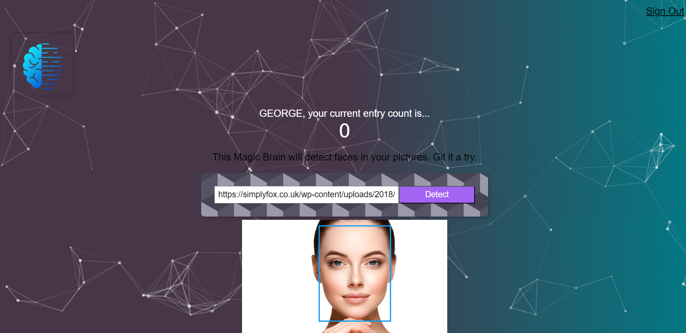

# Face-Detection Web App

## Description

This project is a web application for face detection using the Clarifai API. The application allows users to upload images and visually detect faces in them.

## Technologies and Tools

- **Frontend:**
  - ⚛️ [React](https://reactjs.org/) - JavaScript library for building user interfaces.
  - 🌐 [Tachyons](https://tachyons.io/) - Simplified CSS design system.
  - 🤖 [Clarifai API](https://www.clarifai.com/models/face-detection) - API for face detection.
  - ...

- **Backend:**
  - 🚀 [Node.js](https://nodejs.org/) - JavaScript runtime for server-side development.
  - ⚙️ [Express.js](https://expressjs.com/) - Minimalist web framework for Node.js.
  - 🛢️ [Knex](http://knexjs.org/) - SQL database management system.
  - 🔐 [bcrypt](https://www.npmjs.com/package/bcrypt) - Library for password hashing.
  - 🐘 [PostgreSQL](https://www.postgresql.org/) - Relational database management system.
  - ...

- **Deployment:**
  - ☁️ [Render](https://render.com/) - Platform for deploying and managing web applications.
  - ...

## Usage Instructions

1. 🌐 Visit the [web application](https://myfrontend-t50e.onrender.com/).
2. 📝 Register or log in to an account.
3. 🖼️ Upload images and experiment with face detection.

## Live Demo

[Link to the project](https://myfrontend-t50e.onrender.com/)

## Zero to Mastery Academy Course

This project was developed as part of the [Complete Web Developer in 2024: Zero to Mastery](#) course at [Zero to Mastery Academy](#). The course provides comprehensive training for web development, covering various technologies and approaches.
